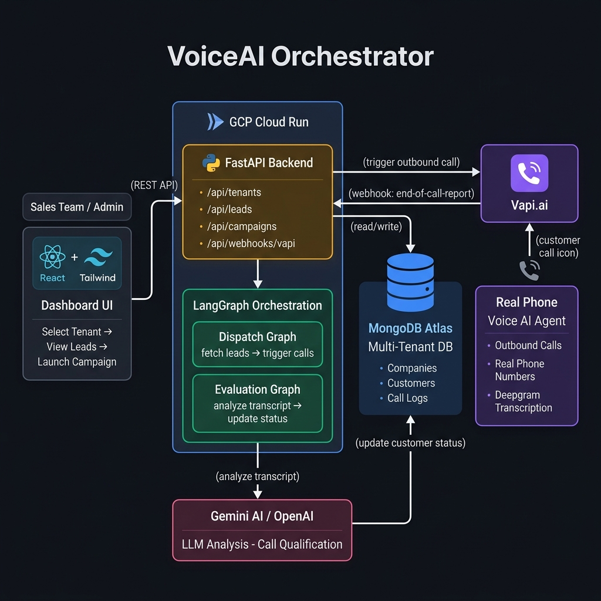

# VoiceAI Orchestrator

A multi-tenant agentic voice AI platform that makes outbound calls to real estate leads, qualifies them using AI, and updates their status in a dashboard — all automatically.

Built for the Krid AI assignment using the exact stack specified: **LangGraph + Vapi.ai + FastAPI + MongoDB + React**.

---

## What it does

When a sales team hits "Launch Campaign" on the dashboard, the system:

1. Fetches all `PENDING` leads for that company from MongoDB
2. Calls each lead's phone number using Vapi.ai (real outbound voice calls)
3. The AI agent conducts a qualifying conversation using the company's custom script
4. When the call ends, Vapi sends a webhook with the full transcript
5. LangGraph runs the transcript through Gemini/OpenAI to determine the outcome
6. The lead's status is updated to `QUALIFIED`, `NOT_INTERESTED`, `FAILED`, or `NEEDS_REVIEW`
7. The dashboard updates in real time

Everything is fully automated — no human needs to be in the loop unless a call comes back with low confidence.

---

## Architecture



```
React Dashboard
      │
      │  REST API calls
      ▼
FastAPI Backend  ──────────────────────►  MongoDB Atlas
(GCP Cloud Run)                           (Multi-tenant DB)
      │                                        ▲
      │  POST /call                            │
      ▼                                        │
  Vapi.ai  ────────────────────────────────────┘
  (Outbound                    webhook: transcript + outcome
   Voice Call)
      │
      ▼
LangGraph Evaluation Graph
      │
      │  analyze transcript
      ▼
  Gemini 1.5 Flash
```

### LangGraph Graphs

There are two stateful graphs in `backend/app/langgraph/`:

**Dispatch Graph** — runs when campaign is triggered:
```
START → fetch_pending_leads → trigger_vapi_calls → END
```

**Evaluation Graph** — runs when webhook arrives:
```
START → extract_transcript → analyze_with_llm → [route_by_confidence] → update_status → END
```

If confidence is below 0.7, the lead is flagged as `NEEDS_REVIEW` instead of being auto-qualified.

---

## Tech Stack

| Layer | Technology |
|---|---|
| Frontend | React 19, Vite, Tailwind CSS v3 |
| Backend | Python 3.11, FastAPI, uvicorn |
| AI Orchestration | LangGraph (stateful graphs) |
| Voice AI | Vapi.ai (outbound calls, Deepgram Nova-2) |
| LLM | Google Gemini 1.5 Flash (OpenAI-compatible endpoint) |
| Database | MongoDB Atlas M0 (Free tier), Motor async driver |
| Deployment | GCP Cloud Run, multi-stage Docker |

---

## Project Structure

```
.
├── backend/
│   ├── app/
│   │   ├── main.py              # FastAPI app, CORS, static file serving
│   │   ├── config.py            # Pydantic settings from .env
│   │   ├── database.py          # Motor MongoDB connection pool
│   │   ├── utils.py             # Shared utilities (utcnow, etc.)
│   │   ├── models/              # Pydantic schemas (Company, Customer, CallLog)
│   │   ├── routers/             # API routes (tenants, leads, campaigns, webhooks)
│   │   ├── services/            # Vapi REST client, LLM service
│   │   └── langgraph/           # Dispatch and Evaluation graphs + state
│   ├── scripts/
│   │   └── seed_db.py           # Seeds 3 companies and 4 leads each (including demo lead)
│   └── requirements.txt
├── frontend/
│   ├── src/
│   │   ├── App.jsx              # Main app, polling logic, state management
│   │   ├── api/client.js        # Axios API layer
│   │   └── components/          # TenantSelector, LeadDirectory, CampaignTrigger, CallLogModal
│   └── package.json
├── deploy/
│   ├── deploy.sh                # Full GCP Cloud Run deployment script
│   └── cloudbuild.yaml          # Cloud Build config for CI/CD
├── Dockerfile                   # Multi-stage: Node build → Python runtime
└── docker-compose.yml           # Local development setup
```

---

## Getting Started

### Prerequisites

- Python 3.11+
- Node.js 20+
- A MongoDB Atlas M0 free cluster
- A Vapi.ai account (free tier works)
- A Google Gemini API key (free at aistudio.google.com)

### Local Setup

**1. Clone the repo**
```bash
git clone https://github.com/Jogith123/Voice-Sas.git
cd Voice-Sas
```

**2. Set up the backend**
```bash
cd backend
python -m venv .venv
.venv\Scripts\activate       # Windows
pip install -r requirements.txt
```

**3. Configure environment variables**

Copy `.env.example` to `.env` and fill in your values:
```bash
cp .env.example .env
```

Required keys:
```env
MONGODB_URI=mongodb+srv://...
VAPI_API_KEY=your-vapi-key
VAPI_PHONE_NUMBER_ID=your-phone-number-id
GEMINI_API_KEY=your-gemini-key
APP_ENV=development
SECRET_KEY=your-random-secret
```

**4. Seed the database**
```bash
python scripts/seed_db.py
```

This creates 3 companies (Sunrise Realty, BlueSky Rentals, Krid AI) with 4 leads each.

**5. Start the backend**
```bash
uvicorn app.main:app --reload --port 8000
```

**6. Start the frontend** (in a new terminal)
```bash
cd frontend
npm install
npm run dev
```

Open `http://localhost:5173` — the dashboard should load with all three companies.

---

## API Reference

The full interactive API docs are available at `/docs` (Swagger UI).

| Endpoint | Method | Description |
|---|---|---|
| `/api/tenants/` | GET | List all companies |
| `/api/leads/` | GET | Get leads for a company |
| `/api/campaigns/trigger` | POST | Start an outbound call campaign |
| `/api/campaigns/stats/:id` | GET | Get status counts for a company |
| `/api/webhooks/vapi` | POST | Vapi webhook receiver |
| `/api/webhooks/vapi/test` | POST | Simulate a completed call (no Vapi needed) |
| `/health` | GET | Health check |

---

## Customer Status Flow

```
PENDING
   │
   │  (campaign triggered)
   ▼
CALL_INITIATED
   │
   │  (call ends, webhook received)
   ▼
[LLM Analysis]
   │
   ├──► QUALIFIED        (confident positive outcome)
   ├──► NOT_INTERESTED   (confident negative outcome)
   ├──► NEEDS_REVIEW     (confidence < 0.7, needs human)
   └──► FAILED           (call errored or no answer)
```

---

## Deploying to GCP Cloud Run

You need the [Google Cloud CLI](https://cloud.google.com/sdk/docs/install) installed and authenticated.

```bash
gcloud auth login
gcloud init
./deploy/deploy.sh
```

The script handles everything:
- Enabling required APIs
- Granting IAM permissions
- Uploading secrets to Secret Manager
- Building the Docker image
- Deploying to Cloud Run

When it finishes, it prints your live URL.

**After deploying**, update your Vapi dashboard with the new webhook URL:
```
https://your-service-url.run.app/api/webhooks/vapi
```

---

## Environment Variables Reference

| Variable | Required | Description |
|---|---|---|
| `MONGODB_URI` | Yes | Full MongoDB Atlas connection string |
| `MONGODB_DB_NAME` | Yes | Database name (default: `voice_saas`) |
| `VAPI_API_KEY` | Yes | Your Vapi.ai API key |
| `VAPI_PHONE_NUMBER_ID` | Yes | The Vapi phone number to call from |
| `VAPI_WEBHOOK_URL` | Yes | Public URL for Vapi to send call events |
| `GEMINI_API_KEY` | Yes | Google Gemini API key |
| `OPENAI_API_KEY` | No | OpenAI fallback (optional) |
| `APP_ENV` | Yes | `development` or `production` |
| `SECRET_KEY` | Yes | HMAC secret for webhook signature verification |
| `BACKEND_CORS_ORIGINS` | No | Allowed origins in production |

---

## Security Notes

- The `.env` file is listed in `.gitignore` and is never committed
- Webhook requests are verified using HMAC-SHA256 signatures (when `SECRET_KEY` is set)
- In production, CORS is locked to specific allowed origins only
- All secrets in GCP are stored in Secret Manager, not as plain environment variables

---

## Known Limitations

- The Vapi free tier has a limited number of call minutes per month
- Outbound calling to Indian numbers (`+91`) works but requires your Vapi account to have international calling enabled
- The lead list has no pagination — it fetches up to 500 leads per company

---

## License

MIT
